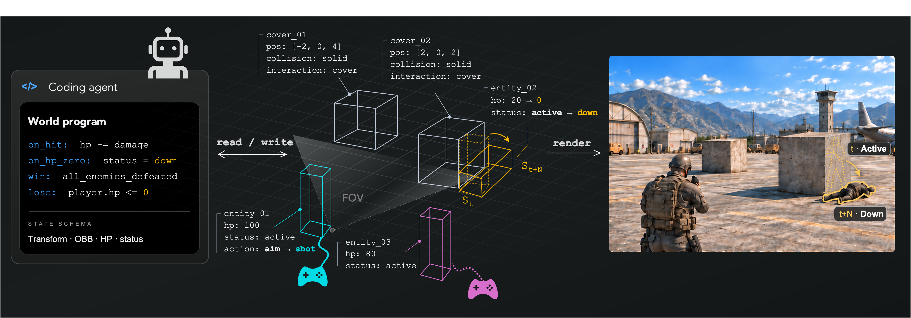

<h1 align="center">Programmable World Model</h1>

<a href="https://alayalab.ai/"><b>Alaya Lab</b></a>

  
  
  

  

  <i>A coding agent reads and writes an explicit world state; the state is compiled into pixel-aligned controls and rendered by a video model.</i>

> An explicit-state-driven framework for programmable generative worlds: a state executor maintains a canonical world state and advances it under player actions and world rules; a deterministic compiler projects the state, represented as state-augmented 3D OBBs, into pixel-aligned controls; and a video model renders the observation.

Video world models are powerful interactive renderers, but plausible observations alone are not a world engine. Programmable World Model decouples world-state maintenance and evolution from visual observation generation, making world facts queryable, modifiable, and verifiable — entities persist off-screen, events are irreversible, and the same world state drives any camera and any visual style.

## 📰 News

- **[2026-09-05]** [Project page](https://alaya-lab.github.io/pwm/) released.

## 🚀 Release Roadmap

- [x] Project page
- [x] Technical report — [PDF](https://alaya-lab.github.io/pwm/paper/Programmable_World_Model.pdf)
- [ ] Inference code
- [ ] Pretrained weights

## Citation

Coming soon.
